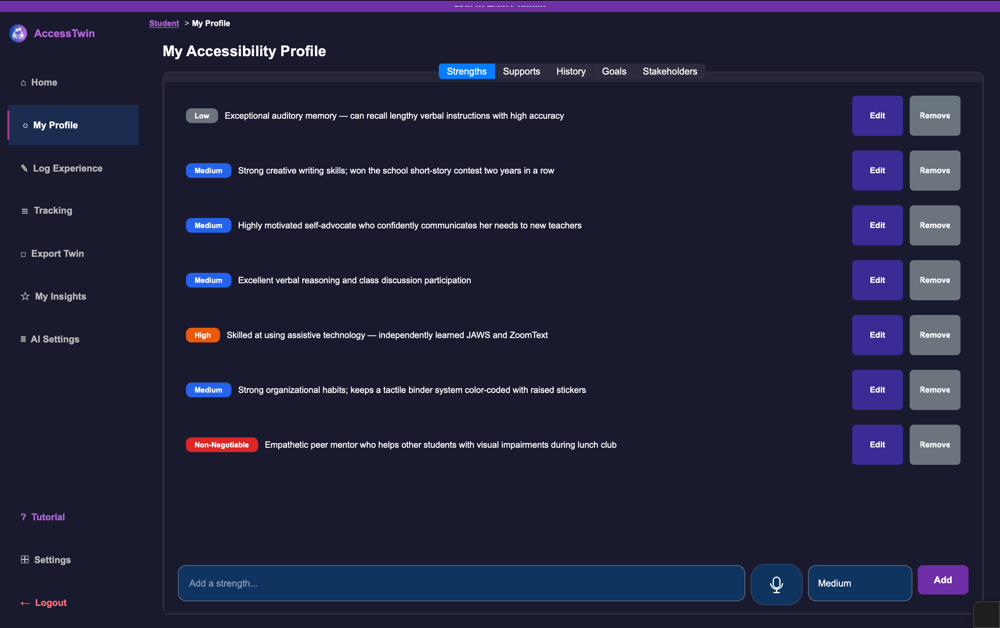
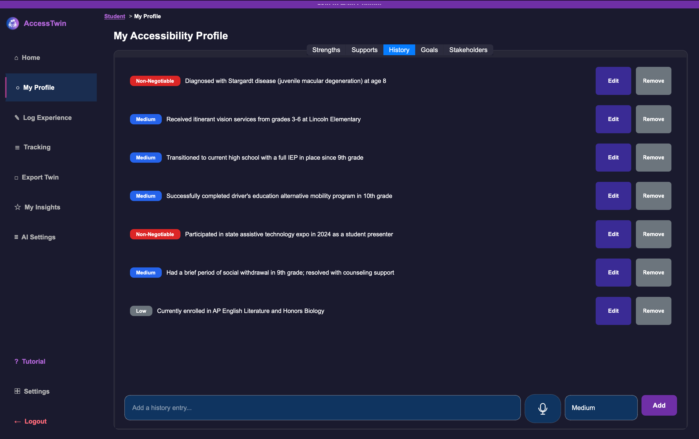
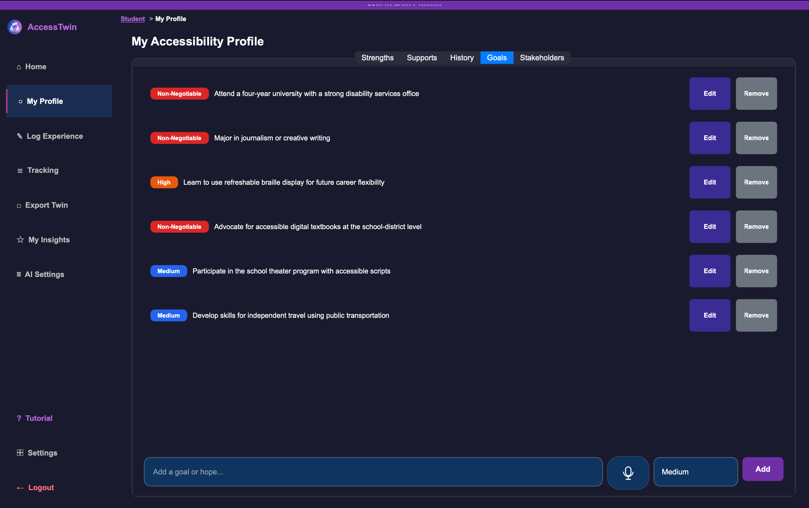
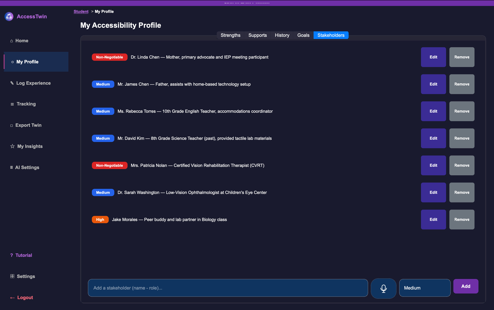
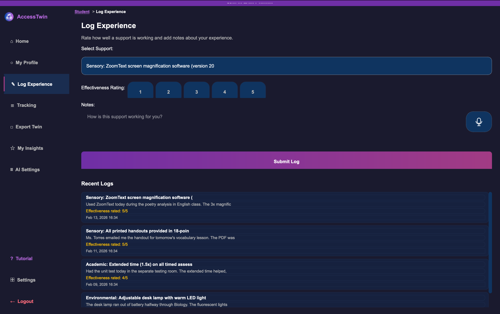
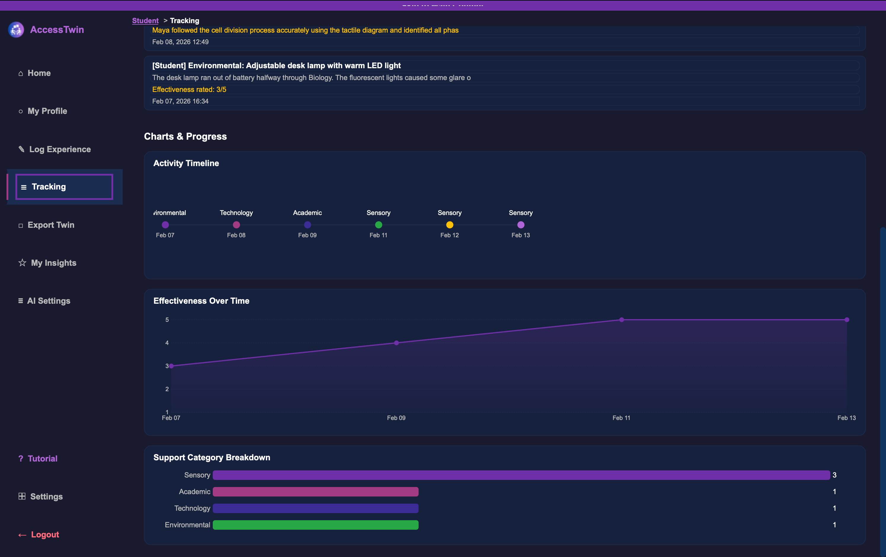
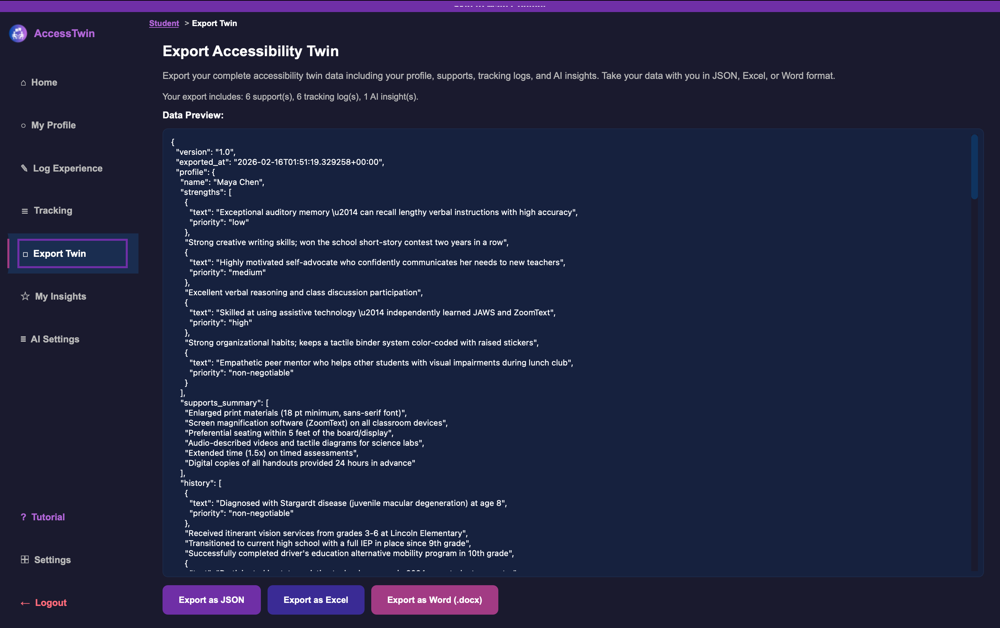
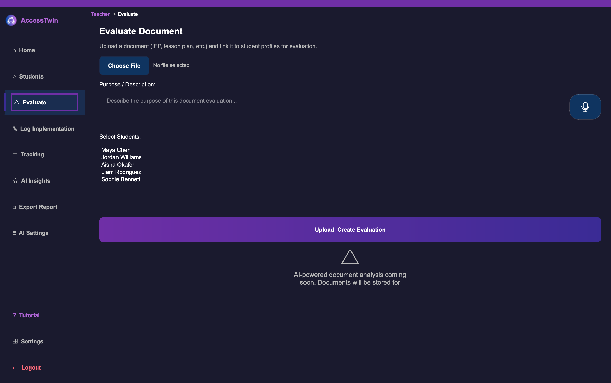
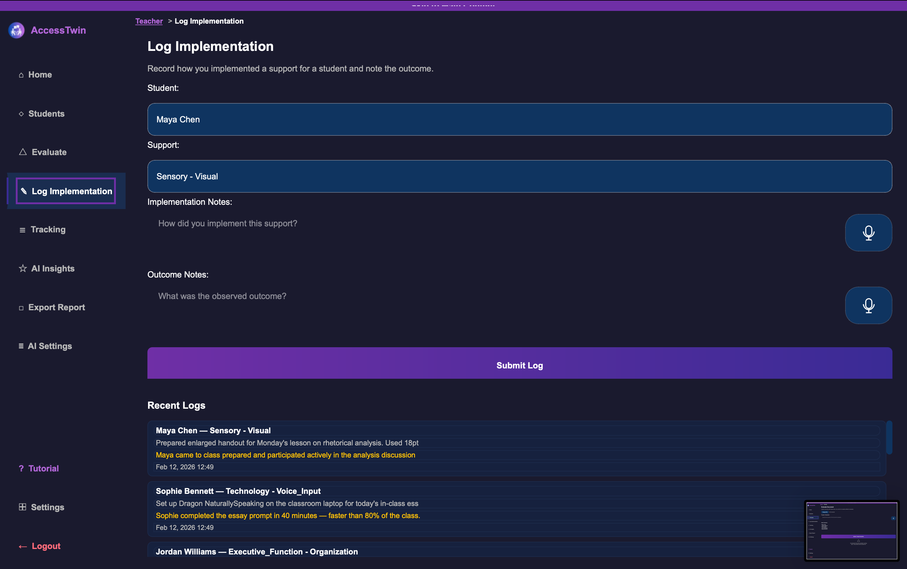
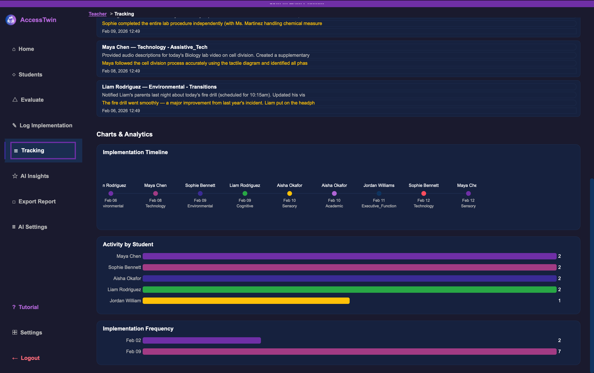

<p align="center">
  
</p>

<h1 align="center">AccessTwin</h1>

<p align="center">
  <strong>Digital Accessibility Twin Manager</strong><br>
  A desktop application that creates "Digital Accessibility Twins" for students with accommodations, allowing teachers to assess and plan supports before meeting with students.
</p>

<p align="center">
  
  
  
  
  
</p>

---

## Table of Contents

- [Overview](#overview)
- [Features](#features)
- [Privacy & Data Sovereignty](#privacy--data-sovereignty)
- [Screenshots](#screenshots)
- [Installation](#installation)
- [Usage](#usage)
- [Project Structure](#project-structure)
- [AI Backend Configuration](#ai-backend-configuration)
- [Accessibility](#accessibility)
- [Testing](#testing)
- [Roadmap](#roadmap)
- [Changelog](#changelog)
- [License](#license)

---

## Overview

AccessTwin is built by **Tech Inclusion Pro** to bridge the gap between students who need accommodations and teachers who provide them. Students create rich profiles documenting their strengths, supports, and goals. Teachers upload learning materials and receive AI-powered analysis of how well those materials align with each student's accessibility needs — all without needing to meet first.

The application follows a **local-first, privacy-focused** architecture. All data is stored locally with AES-256 encryption, and AI processing defaults to local models (Ollama, LM Studio, GPT4All). Cloud AI providers (OpenAI, Anthropic) are available but require explicit dual consent.

---

## Features

### Role-Based Authentication
- **Two distinct roles:** Student and Teacher, each with their own login tab and color-coded UI
- **Secure accounts** with bcrypt password hashing and configurable security questions
- **Password recovery** through a multi-step security question verification flow
- **Audit logging** — every login, logout, registration, and password reset is recorded

### Three-Tab Login Screen
- **Student Login** — Magenta accent (#a23b84)
- **Teacher Login** — Deep blue accent (#3a2b95)
- **Register** — Purple accent (#6f2fa6) with role selector, password confirmation, security question, and terms consent
- Password visibility toggle, forgot password flow, and pre-login accessibility toolbar
- **Save login details** — optional checkbox on student and teacher login tabs that persists credentials locally via QSettings for convenient re-login

### AI Backend Selector
AccessTwin supports multiple AI providers for analyzing learning materials against student profiles:

| Provider | Type | Default Model | Connection |
|----------|------|---------------|------------|
| **Ollama** | Local | gemma3:4b | localhost:11434 |
| **LM Studio** | Local | default | localhost:1234 |
| **GPT4All** | Local | Llama 3 8B | Direct Python |
| **OpenAI** | Cloud | gpt-4o | API |
| **Anthropic** | Cloud | Claude | API |

- **Local-first default** — no data leaves the machine unless explicitly configured
- **Connection testing** — verify provider connectivity before saving
- **Dual cloud consent** — both institutional approval and data transmission acknowledgment required

### Encrypted Database
- **SQLite** via SQLAlchemy ORM with 10 tables:
  - `users` — accounts with role, credentials, settings
  - `student_profiles` — strengths, supports, history, hopes, stakeholders
  - `support_entries` — categorized supports with UDL/POUR mappings and effectiveness ratings
  - `documents` — uploaded teacher materials
  - `twin_evaluations` — AI analysis results with confidence scores
  - `tracking_logs` — implementation and outcome tracking
  - `consultation_logs` — coach conversation history for AI insights analysis
  - `insight_logs` — AI-generated insight reports with timestamps and chat conversations
  - `audit_logs` — security event trail
  - `consent_records` — data consent tracking
- **AES-256 field-level encryption** (Fernet) for sensitive data, with PBKDF2 key derivation from machine identity

### Card-Based Student Profiles with Priority Levels
Student profile items (Strengths, History, Goals, Stakeholders) are displayed as rich cards rather than plain text:

- **Priority badges** — each item carries a priority level rendered as a colored pill:
  - **Non-Negotiable** (red) — core identity items and critical accommodations
  - **High** (orange) — important preferences and key relationships
  - **Medium** (blue) — general items
  - **Low** (gray) — nice-to-haves and minor details
- **Inline editing** — Edit button opens a dialog to change text and priority; Remove button deletes with one click
- **Scrollable card layout** — consistent dark-card styling matching the Supports tab aesthetic
- **Backward compatible** — old plain-string data is auto-normalized to `{"text": ..., "priority": "medium"}` on read, so existing profiles continue to work without migration

### Privacy-Preserving AI Coach
Teachers can consult an AI Digital Accessibility Coach that reads the full student profile confidentially:

- **Two-tier data model** — the Privacy Aggregator produces (a) teacher-safe aggregated themes and (b) a confidential AI-only context block
- **Teachers never see raw student data** — only broad theme summaries (e.g., "Strong auditory processing" instead of specific medical details)
- **AI reads everything privately** — the coach receives full student context to give informed guidance, but its responses are phrased in general, non-identifying terms
- **Theme mapping** — 20+ keyword patterns for strengths and 10+ for goals map specific text to broad educational themes
- **Consultation persistence** — coach conversations are saved and used by the AI Insights feature for longitudinal analysis

### AI Insights (Teacher)
Teachers can generate AI-powered analysis of their past coach consultations for any imported student:

- **Student selector** — choose from imported student twins with consultation counts
- **Streaming output** — insights are streamed in real-time as the AI generates them
- **POUR/UDL lens** — analysis maps student needs to Perceivable/Operable/Understandable/Robust and Engagement/Representation/Action & Expression frameworks
- **Five analysis sections** — Consultation Overview, Question Patterns, Student Needs Analysis, Teacher Preparation Recommendations, and Growth Trajectory
- **Insight saving with timestamps** — each generated insight is automatically saved with a timestamp to the InsightLog database
- **History browsing** — dropdown selector to revisit any past insight for a given student
- **Chat with insights** — after generating or selecting an insight, teachers can chat with the AI to ask follow-up questions; conversations are persisted and restored when revisiting saved insights

### My Insights (Student)
Students can generate AI-powered analysis of their own support effectiveness:

- **Support effectiveness analysis** — analyses SupportEntry ratings and TrackingLog notes, not consultation history
- **Strengths-based** — speaks directly to the student with warm, encouraging language using first name only
- **Five analysis sections** — What's Working Well, What Needs Attention, Patterns & Trends, Suggestions for Discussion, and Summary
- **Self-advocacy prompts** — provides 3-5 specific conversation topics the student can raise with their teacher
- **Empty state handling** — guides students to add supports before generating insights
- **Insight saving with timestamps** — each generated insight is automatically saved with a timestamp to the InsightLog database
- **History browsing** — dropdown selector to revisit any past insight
- **Chat with insights** — students can chat with the AI about any insight using a warm, strengths-based tone; conversations are persisted and restored when revisiting saved insights

### Student Data Export
Students can export their complete Digital Twin data for portability:

- **JSON export** — full twin data including profile, supports, tracking logs, and AI insights with chat conversations
- **Excel export** — four styled sheets (Profile, Support Entries, Tracking Logs, AI Insights) via openpyxl with purple-branded headers
- **DOCX export** — formatted Word document with headings, bullet lists, support tables, and insight chat transcripts via python-docx
- **Timestamped filenames** — all exports use `{name}_twin_{YYYYMMDD_HHMM}.{ext}` format

### Teacher Report Export
Teachers can generate and export AI-powered student reports as Word documents:

- **Report configuration dialog** — popup with checkboxes to toggle report sections (Profile Summary, Support Entries, Tracking Logs, Consultation History, AI Insights, Insight Chat Conversations) and a rich text area for AI guidance
- **AI-generated reports** — the AI generates a formatted report based on selected data and teacher guidance, streamed in real-time
- **Per-student reports** — select any imported student from a dropdown to generate their report
- **DOCX export** — markdown-to-DOCX converter produces a professionally formatted Word document with purple branding, student name, and generation date
- **Teacher guidance** — free-text area lets teachers shape the report tone, emphasis, and structure (e.g., "Focus on progress in reading supports" or "Write for a parent audience")

### AI Transparency ("How was this decided?")
Every AI feature includes a "How was this decided?" button that opens a transparency dialog showing:

- **AI Configuration** — provider type (local/cloud), provider name, and model
- **Guiding Principles** — the disability justice principles governing the AI's behavior
- **Privacy Rules** — exactly what privacy constraints the AI operates under
- **Information Provided to AI** — aggregated summary of what data was sent (never raw data)
- **Model Confidence** — honest disclosure that AI outputs are statistical and may contain inaccuracies
- **Warnings & Limitations** — specific caveats for each feature (e.g., session drift, data volume effects)

### Voice Input (Speech-to-Text)
Every text input field across the application includes a microphone button for voice dictation:

- **Powered by faster-whisper** — local speech-to-text processing, no audio leaves your device
- **One-time model download** — the STT model (~75 MB for "tiny") downloads automatically on first use and is cached locally for offline use
- **Available everywhere** — microphone buttons appear next to profile inputs, experience/implementation logs, chat inputs, evaluation descriptions, report guidance, and edit dialogs
- **Platform-specific error help** — if the model download fails, the dialog shows detailed troubleshooting instructions specific to your operating system (Mac, Windows, or Linux) with exact terminal commands

### Timeline View & Progress Charts
Both student and teacher Tracking pages include interactive QPainter-based charts that visualize logged data:

**Student Tracking:**
- **Activity Timeline** — horizontal timeline with colored dots showing each logged experience chronologically (scrollable, up to 15 entries)
- **Effectiveness Over Time** — line chart with Y-axis 1-5 showing rating trends extracted from outcome notes (include "Effectiveness rated: 4/5" in notes to track)
- **Support Category Breakdown** — horizontal bar chart showing log counts per support category

**Teacher Tracking:**
- **Implementation Timeline** — horizontal timeline showing each implementation with student name and support category
- **Activity by Student** — horizontal bar chart showing implementation counts per student
- **Implementation Frequency** — horizontal bar chart showing weekly activity counts

All charts use the brand color palette, respect accessibility color overrides, and gracefully show EmptyState messages when no data exists.

### Step-by-Step Tutorial
A built-in tutorial accessible from the sidebar walks users through every feature:

- **Role-aware content** — students see 8 steps, teachers see 9 steps, each tailored to their specific features
- **Previous/Next navigation** — move through steps at your own pace with dot indicators showing progress
- **Covers every feature** — profile setup, AI configuration, logging, tracking charts, AI insights, export, accessibility settings, and keyboard shortcuts
- **Detailed instructions** — each step includes numbered instructions with specific UI directions (e.g., "Click 'My Profile' in the left sidebar")

### Contextual Help System
The "?" help button provides detailed, context-aware guidance following a consistent 3-part format:

1. **What is the issue** — describes what the feature does and what might be wrong
2. **How to fix it** — explains the solution approach
3. **Step-by-step instructions** — numbered instructions with specific actions

Available for 10 contexts: general, profile, AI settings, log experience, tracking, insights, export, evaluate, students, and speech-to-text. AI-related help dialogs include an "Open Full AI Setup Guide" button.

### AI Model Setup Guide
A comprehensive tabbed guide accessible from help buttons and the tutorial, with platform-specific instructions:

| Tab | Content |
|-----|---------|
| **Mac (Ollama)** | Homebrew install, .dmg download, Terminal commands, Apple Silicon notes |
| **Windows (Ollama)** | Installer download, system tray usage, Command Prompt commands, NVIDIA notes |
| **Linux (Ollama)** | curl install script, systemd service management, GPU setup links |
| **LM Studio (All)** | GUI-based setup for Mac/Windows/Linux with .AppImage instructions |
| **Cloud (API Key)** | OpenAI and Anthropic signup, API key creation, dual consent setup |

Each tab includes troubleshooting for common errors: connection refused, model not found, permission denied, SSL certificate errors, and firewall configuration.

### Outline Icon System
All UI icons use simple geometric outline characters (Unicode line-drawing symbols) instead of colored emoji:
- Renders consistently across all platforms and font configurations
- White-line-only aesthetic that respects the dark theme
- Accessible to screen readers via semantic accessible names on all interactive elements

### Support Categorization
Student supports are organized across seven categories aligned with educational frameworks:

| Category | Examples |
|----------|----------|
| Sensory | Large print, screen reader, captioning, FM system |
| Motor | Alternative keyboard, voice-to-text, accessible seating |
| Cognitive | Simplified instructions, visual schedules, chunked assignments |
| Communication | AAC device, visual supports, social stories |
| Social-Emotional | Calm-down space, peer buddy system, check-in system |
| Executive Function | Task checklists, visual timers, organizational systems |
| Environmental | Adapted workspace, sensory considerations |

### Comprehensive Accessibility (WCAG 2.1 AA)
- **Font scaling** — Small, Medium, Large, Extra Large presets
- **Text spacing controls** — adjustable letter spacing (0-8px), word spacing (0-12px), and line height extra (0-12px) applied via QSS (WCAG 1.4.12)
- **Color blind modes** — Protanopia, Deuteranopia, Tritanopia, Monochrome (based on Wong 2011 palette)
- **High contrast mode** — enhanced text visibility with improved error/success color overrides
- **Dyslexia-friendly font** toggle
- **Custom cursors** — Large black, Large white, Crosshair, High visibility (yellow/black), Pointer with trail
- **Reading ruler** — horizontal highlight band that follows cursor position
- **Reduced motion** — disables all CSS transitions and animations via QSS enforcement
- **Always-visible focus indicators** — 2px focus outlines on all focusable elements by default; enhanced mode increases to 4px (WCAG 2.4.7)
- **Skip to Main Content** — hidden button in both dashboards appears on focus and jumps past sidebar navigation (WCAG 2.4.1)
- **Device-level persistence** — preferences saved to `~/.accesstwin/` and restored before login
- **Pre-login access** — accessibility toolbar visible on the login screen
- **Delete confirmations** — all destructive actions (profile item removal, AI config clear) require explicit confirmation (WCAG 3.3.4)

### Keyboard Navigation
- All interactive widgets have `StrongFocus` policy
- Labels linked to inputs via `setBuddy()` with mnemonic accelerators
- Chart widgets are keyboard-focusable with painted focus indicators
- Minimum 44x44px touch targets
- Logical tab order on every screen
- Focus set automatically after screen transitions
- Error messages focus the relevant input field after dismissal
- `Ctrl+/` — Keyboard shortcuts reference dialog
- `Ctrl+Q` — Quit application

### Data-Driven Frameworks
Built-in JSON reference data for:
- **UDL Checkpoints** — Engagement, Representation, Action & Expression
- **WCAG Criteria** — Perceivable, Operable, Understandable, Robust
- **POUR Principles** — with descriptions and guidelines
- **Support Templates** — pre-built support entries by category
- **Color Palettes** — Wong 2011 color-blind safe palette

---

## Privacy & Data Sovereignty

AccessTwin handles some of the most sensitive data in education — student disability diagnoses, medical histories, accommodation needs, and family relationships. Protecting this data is not just a technical requirement but an ethical imperative. Students with disabilities are disproportionately affected by data breaches because their information can be used to discriminate in employment, housing, insurance, and education.

### Why Privacy Matters Here

| Risk | Why It Matters |
|------|----------------|
| **Re-identification** | Detailed accommodation descriptions (e.g., "bilateral cochlear implants at age 2") uniquely identify students even without names |
| **Discrimination** | Disability data disclosed to unauthorized parties can lead to bias in college admissions, hiring, and insurance |
| **Power imbalance** | Students are minors who cannot fully consent to how their data is used; the system must protect them by default |
| **Teacher over-access** | Teachers need enough information to provide accommodations but should not see raw medical or family details |
| **Cloud AI leakage** | Sending student profiles to cloud AI providers creates permanent copies outside institutional control |

### How AccessTwin Protects Student Data

**1. Local-First Architecture**
- All data is stored in a local SQLite database on the user's machine — never on a remote server
- AES-256 field-level encryption (Fernet) protects sensitive fields at rest
- No telemetry, no analytics, no phone-home behavior

**2. Privacy-Preserving AI (Two-Tier Aggregation)**
- The **Privacy Aggregator** converts raw student data into two tiers before any teacher interaction:
  - **Teacher-safe tier** — only broad themes (e.g., "Strong auditory processing", "Post-secondary education goals"), category counts, and framework coverage percentages
  - **AI-only tier** — full confidential student context, sent only to the AI coach and never displayed to the teacher
- Teachers see theme summaries, never raw profile text
- The AI coach reads full context privately to give informed, specific guidance — but its responses use general educational language

**3. Dual Cloud Consent**
- Local AI providers (Ollama, LM Studio, GPT4All) are the default — no data leaves the machine
- Cloud AI (OpenAI, Anthropic) requires two explicit consent checkboxes:
  - Institutional approval confirmation
  - Data transmission acknowledgment
- Both must be checked before cloud configuration can be saved

**4. Priority-Based Consent Awareness**
- Students mark each profile item with a priority level (Low / Medium / High / Non-Negotiable)
- Non-Negotiable items represent core identity and critical accommodations that the student considers essential
- This metadata helps educators understand which accommodations are absolute requirements vs. preferences

**5. Audit Trail**
- Every login, logout, registration, and password reset is recorded in `audit_logs`
- Consent decisions are tracked in `consent_records`
- No data is deleted without explicit user action

### Compliance Alignment

AccessTwin's privacy architecture aligns with:
- **FERPA** (Family Educational Rights and Privacy Act) — student data stays local, teacher access is limited to aggregated themes
- **IDEA** (Individuals with Disabilities Education Act) — supports IEP/504 documentation while protecting confidentiality
- **COPPA** (Children's Online Privacy Protection Act) — no data is transmitted to third parties by default
- **GDPR Article 9** (Special Category Data) — disability data receives the highest level of protection through encryption and access controls

---

## Screenshots

### Student Experience

#### Student Home Dashboard


#### My Accessibility Profile — Strengths


#### My Accessibility Profile — Supports


#### My Accessibility Profile — History


#### My Accessibility Profile — Goals


#### My Accessibility Profile — Stakeholders


#### Log Experience


#### Student-Led Progress Tracking


#### My Insights (AI-Powered)


#### Export Accessibility Twin


### Teacher Experience

#### Teacher Home Dashboard


#### Evaluate Document


#### Log Implementation


#### Teacher Tracking & Analytics


### Accessibility

#### Accessibility Settings Panel


---

## Installation

### Download (Recommended)

Download the latest pre-built release for your platform — no Python installation required:

> **[Download AccessTwin from the Releases page](https://github.com/Tech-Inclusion-Pro/Digital-Accessiblity-Twin/releases/latest)**

| Platform | Download | How to Install |
|----------|----------|----------------|
| **macOS (Apple Silicon)** — M1/M2/M3/M4 | `AccessTwin-macOS-Apple-Silicon.dmg` | 1. Download the `.dmg` file<br>2. Double-click to open it<br>3. Drag **AccessTwin** into your **Applications** folder<br>4. Launch from **Launchpad**, **Spotlight** (search "AccessTwin"), or **Finder > Applications** |
| **macOS (Intel)** | `AccessTwin-macOS-Intel.dmg` | 1. Download the `.dmg` file<br>2. Double-click to open it<br>3. Drag **AccessTwin** into your **Applications** folder<br>4. Launch from **Launchpad**, **Spotlight**, or **Finder > Applications** |
| **Windows (64-bit)** | `AccessTwin-Windows-x64.zip` | 1. Download the `.zip` file<br>2. Right-click and select **Extract All...**<br>3. Open the extracted folder<br>4. Double-click **AccessTwin.exe** to launch |
| **Linux (x86_64)** | `AccessTwin-Linux-x86_64.tar.gz` | 1. Download the `.tar.gz` file<br>2. Extract: `tar -xzf AccessTwin-Linux-x86_64.tar.gz`<br>3. Make executable: `chmod +x AccessTwin`<br>4. Run: `./AccessTwin` |

#### Troubleshooting First Launch

<details>
<summary><strong>macOS: "AccessTwin is damaged" or "unidentified developer"</strong></summary>

Since AccessTwin is not signed with an Apple Developer certificate, macOS Gatekeeper may block it on first launch.

**Option A — Right-click to open (easiest):**
1. Find **AccessTwin** in your Applications folder
2. **Right-click** (or Control-click) the app
3. Select **Open** from the context menu
4. Click **Open** in the dialog that appears
5. You only need to do this once — subsequent launches work normally

**Option B — Terminal command:**
```bash
xattr -cr /Applications/AccessTwin.app
```
Then open the app normally.
</details>

<details>
<summary><strong>Windows: SmartScreen blocks the app</strong></summary>

1. When the "Windows protected your PC" dialog appears, click **More info**
2. Click **Run anyway**
3. You only need to do this once
</details>

<details>
<summary><strong>Linux: Permission denied</strong></summary>

Make sure the binary is executable:
```bash
chmod +x AccessTwin
./AccessTwin
```

If you see missing library errors, install the required system packages:
```bash
# Ubuntu/Debian
sudo apt-get install libegl1 libxkbcommon0 libxcb-cursor0 libportaudio2

# Fedora/RHEL
sudo dnf install mesa-libEGL libxkbcommon xcb-util-cursor portaudio
```
</details>

#### Which macOS version do I have?

Not sure whether your Mac uses Apple Silicon or Intel? Click the **Apple menu** () > **About This Mac**:
- If it says **Apple M1**, **M2**, **M3**, or **M4** — download the **Apple Silicon** version
- If it says **Intel** — download the **Intel** version

---

### Install from Source (Developer)

If you prefer to run from source or want to contribute:

#### Prerequisites
- **Python 3.10** or later
- **macOS 12+**, **Windows 10+**, or **Linux** (Ubuntu 20.04+)

#### Steps

1. **Clone the repository:**
   ```bash
   git clone https://github.com/Tech-Inclusion-Pro/Digital-Accessiblity-Twin.git
   cd Digital-Accessiblity-Twin
   ```

2. **Create a virtual environment (recommended):**
   ```bash
   python -m venv venv
   source venv/bin/activate        # macOS/Linux
   # venv\Scripts\activate          # Windows
   ```

3. **Install dependencies:**
   ```bash
   pip install -r requirements.txt
   ```

4. **Run the application:**
   ```bash
   python main.py
   ```

#### Building from Source

To create your own standalone executable:

```bash
pip install pyinstaller
pyinstaller accesstwin.spec
```

The built application will be in the `dist/` directory.

### Dependencies

| Package | Version | Purpose |
|---------|---------|---------|
| PyQt6 | >= 6.5.0 | Desktop UI framework |
| SQLAlchemy | >= 2.0 | Database ORM |
| bcrypt | latest | Password hashing |
| aiohttp | latest | Async HTTP for AI backends |
| cryptography | latest | AES-256 field encryption |
| python-docx | latest | Word document generation (DOCX export) |
| openpyxl | latest | Excel workbook generation (XLSX export) |
| faster-whisper | latest | Local speech-to-text engine |
| sounddevice | latest | Microphone audio capture |
| numpy | latest | Audio processing for STT |

---

## Usage

### First Launch

1. **Open AccessTwin** — the three-tab login screen appears
2. **Adjust accessibility settings** using the toolbar at the top (font size, contrast, color mode) — these persist across sessions
3. **Create an account** — click the "Register" tab, select your role (Student or Teacher), fill in credentials, choose a security question, agree to terms, and click "Create Account"
4. **Log in** — use the Student Login or Teacher Login tab matching your role

### Student Workflow (Phase 2+)

1. Log in on the **Student Login** tab
2. Create your accessibility profile — document strengths, needed supports, history, and goals
3. Categorize each support (sensory, motor, cognitive, etc.)
4. Map supports to UDL checkpoints and POUR principles
5. Share your Digital Twin with your teachers

### Teacher Workflow (Phase 2+)

1. Log in on the **Teacher Login** tab
2. Upload learning materials (documents, assignments, assessments)
3. Select a student's Digital Twin profile
4. Run AI analysis to evaluate material accessibility against the student's needs
5. Review suggestions, confidence scores, and AI reasoning
6. Track implementation and outcomes over time

### AI Configuration

1. From the dashboard, open **AI Settings** (Setup Wizard)
2. Choose **Local** (recommended) or **Cloud**
3. For local: select Ollama/LM Studio/GPT4All, set server URL and model
4. For cloud: select OpenAI/Anthropic, enter API key, and check **both** consent boxes
5. Click **Test Connection** to verify
6. Click **Save Configuration**

### Password Recovery

1. Click "Forgot password?" on the login screen
2. Enter your username
3. Answer your security question(s)
4. Set a new password (minimum 8 characters)

---

## Project Structure

```
accesstwin/
├── main.py                          # Application entry point
├── requirements.txt                 # Python dependencies
├── assets/
│   └── logo.png                     # Application logo
├── config/
│   ├── brand.py                     # Brand colors, role accents, spacing
│   ├── constants.py                 # Enums (UserRole, SupportCategory, etc.)
│   └── settings.py                  # Color scheme, app settings, get_colors()
├── data/
│   ├── udl_checkpoints.json         # UDL framework reference data
│   ├── wcag_criteria.json           # WCAG 2.1 criteria reference
│   ├── pour_principles.json         # POUR principles reference
│   ├── support_templates.json       # Pre-built support templates
│   └── color_palettes.json          # Color-blind safe palettes
├── stt/
│   ├── __init__.py
│   ├── engine.py                    # faster-whisper STT engine
│   ├── stt_settings_store.py        # STT model settings persistence
│   └── workers.py                   # Background download & transcription workers
├── models/
│   ├── database.py                  # DatabaseManager, SQLAlchemy setup
│   ├── auth.py                      # AuthManager with role enforcement
│   ├── user.py                      # User model
│   ├── student_profile.py           # StudentProfile model
│   ├── support.py                   # SupportEntry model
│   ├── document.py                  # Document model
│   ├── evaluation.py                # TwinEvaluation model
│   ├── tracking.py                  # TrackingLog model
│   ├── consultation_log.py          # ConsultationLog model (coach conversations)
│   ├── insight_log.py               # InsightLog model (AI insights with chat)
│   └── audit.py                     # AuditLog + ConsentRecord models
├── seed_demo_data.py                    # Demo data seeder (5 students, 2 teachers)
├── ai/
│   ├── backend_manager.py           # Unified AI facade
│   ├── ai_settings_store.py         # Persistent AI configuration storage
│   ├── privacy_aggregator.py        # Two-tier privacy aggregation engine
│   ├── ollama_client.py             # Ollama local client
│   ├── lmstudio_client.py           # LM Studio client (OpenAI-compatible)
│   ├── gpt4all_client.py            # GPT4All direct Python client
│   ├── cloud_client.py              # OpenAI + Anthropic cloud client
│   └── prompts/
│       ├── __init__.py              # System prompt stubs
│       ├── coach_prompt.py          # AI coach system prompt builder
│       ├── insights_prompt.py       # Teacher AI insights system prompt
│       └── student_insights_prompt.py # Student My Insights system prompt
├── ui/
│   ├── accessibility.py             # AccessibilityManager singleton
│   ├── accessibility_prefs.py       # Device-level prefs persistence
│   ├── color_blind_engine.py        # Wong 2011 palette, contrast validation
│   ├── cursor_trail.py              # Cursor trail overlay widget
│   ├── reading_ruler.py             # Reading ruler overlay widget
│   ├── focus_manager.py             # Keyboard nav, tab trapping, announcements
│   ├── theme.py                     # Convenience re-exports
│   ├── theme_engine.py              # QSS generation with role-aware accents
│   ├── navigation.py                # MainWindow, screen routing
│   ├── screens/
│   │   ├── login_screen.py          # Three-tab login (Student/Teacher/Register)
│   │   ├── setup_wizard.py          # AI backend configuration wizard
│   │   ├── ai_settings_page.py      # AI backend settings page (sidebar)
│   │   ├── student/
│   │   │   ├── dashboard.py         # Student sidebar + stacked pages
│   │   │   ├── home_page.py         # Student home with stats and supports grid
│   │   │   ├── profile_page.py      # 5-tab profile editor (card-based)
│   │   │   ├── log_experience_page.py  # Student experience logging
│   │   │   ├── tracking_page.py     # Student tracking timeline
│   │   │   ├── export_page.py       # Digital Twin export (JSON, Excel, DOCX)
│   │   │   └── insights_page.py     # Student My Insights with saving & chat
│   │   └── teacher/
│   │       ├── dashboard.py         # Teacher sidebar + stacked pages
│   │       ├── home_page.py         # Teacher home with stats and student grid
│   │       ├── students_page.py     # Student twin import and browsing
│   │       ├── evaluate_page.py     # Document upload and AI evaluation
│   │       ├── log_impl_page.py     # Teacher implementation logging
│   │       ├── tracking_page.py     # Teacher tracking and gap analysis
│   │       ├── coach_dialog.py      # AI Digital Accessibility Coach dialog
│   │       ├── insights_page.py     # Teacher AI Insights with saving & chat
│   │       └── export_page.py       # Teacher report export (AI-generated DOCX)
│   └── components/
│       ├── accessibility_panel.py   # Full accessibility preferences dialog
│       ├── accessibility_toolbar.py # Quick-access font/contrast/color bar
│       ├── ai_setup_guide_dialog.py # Platform-specific AI setup guide (Mac/Win/Linux)
│       ├── breadcrumb.py            # Navigation breadcrumb trail
│       ├── chart_utils.py           # Shared chart helpers and color palette
│       ├── edit_item_dialog.py      # Edit item text and priority dialog
│       ├── empty_state.py           # Empty state placeholder
│       ├── help_button.py           # Contextual help button with 3-part guidance
│       ├── horizontal_bar_chart.py  # QPainter horizontal bar chart widget
│       ├── line_chart.py            # QPainter line chart for effectiveness trends
│       ├── mic_button.py            # Microphone button for voice input (STT)
│       ├── model_download_dialog.py # STT model download with error troubleshooting
│       ├── profile_item_card.py     # Card widget for profile items with priority
│       ├── rating_widget.py         # Star rating input widget
│       ├── shortcuts_dialog.py      # Keyboard shortcuts reference (Ctrl+/)
│       ├── stat_card.py             # Dashboard metric card
│       ├── support_card.py          # Support entry card with UDL/POUR tags
│       ├── timeline_chart.py        # QPainter horizontal timeline widget
│       ├── transparency_dialog.py   # AI transparency "How was this decided?" dialog
│       └── tutorial_dialog.py       # Step-by-step tutorial walkthrough
├── utils/
│   ├── encryption.py                # AES-256 Fernet encryption manager
│   └── validators.py                # Input validation (username, password, email)
├── tests/
│   ├── conftest.py                  # Shared fixtures (tmp DB, auth manager)
│   ├── test_database.py             # Table creation, CRUD, encryption roundtrip
│   ├── test_auth.py                 # Registration, login, role enforcement, recovery
│   ├── test_ai_backends.py          # Connection test mocks for all providers
│   └── test_accessibility.py        # Color blind palettes, contrast, prefs persistence
├── fonts/                           # Reserved for bundled fonts (Phase 2)
└── tutorials/                       # Reserved for tutorial content (Phase 2)
```

---

## AI Backend Configuration

### Ollama (Recommended for Local Use)

1. Install Ollama: https://ollama.com
2. Pull a model: `ollama pull gemma3:4b`
3. Ollama runs automatically on `localhost:11434`
4. In AccessTwin, select **Local > Ollama** and click **Test Connection**

### LM Studio

1. Install LM Studio: https://lmstudio.ai
2. Download a model and start the local server
3. Server runs on `localhost:1234` by default
4. In AccessTwin, select **Local > LM Studio**

### GPT4All

1. Install: `pip install gpt4all`
2. Models download automatically on first use
3. In AccessTwin, select **Local > GPT4All**

### Cloud Providers (OpenAI / Anthropic)

Cloud usage requires **dual consent**:
1. **Institutional approval** — confirm your institution permits cloud AI for student data
2. **Data transmission acknowledgment** — understand that data will be sent to a third-party service

Both checkboxes must be checked before cloud configuration can be saved.

---

## Accessibility

AccessTwin is built with accessibility as a core principle, not an afterthought. The accessibility system works **before login** so all users can configure their experience immediately.

### Pre-Login Accessibility Toolbar
Available on the login screen with quick controls for:
- Font size increase/decrease
- High contrast toggle
- Color blind mode selector
- Full settings button

### Full Accessibility Panel
Accessed via the "Settings" button, with options organized into five groups:

| Group | Settings |
|-------|----------|
| **Text & Font** | Font size (4 scales), dyslexia-friendly font |
| **Text Spacing** | Letter spacing (0-8px), word spacing (0-12px), line height extra (0-12px) |
| **Colors & Contrast** | High contrast mode, color blind mode (5 options) |
| **Cursor & Reading** | Custom cursor (6 styles), reading ruler overlay |
| **Motion & Focus** | Reduced motion (disables animations), enhanced focus indicators (thicker outlines) |

### Color Blind Modes
Based on the **Wong 2011** color palette (Nature Methods), ensuring all UI elements remain distinguishable:

| Mode | Condition | Adaptation |
|------|-----------|------------|
| Protanopia | Red-blind | Blue/green substitutions |
| Deuteranopia | Green-blind | Blue/orange substitutions |
| Tritanopia | Blue-blind | Pink/green substitutions |
| Monochrome | Grayscale | Full grayscale palette |

### WCAG 2.1 AA Compliance
- **1.1.1 Non-text Content** — all charts provide accessible descriptions with data summaries; decorative icons marked with empty accessible names; UDL/POUR tags include text prefixes ("UDL:" / "POUR:") so they are not color-only
- **1.3.1 Info and Relationships** — form labels linked to inputs via `setBuddy()` with mnemonic accelerators
- **1.4.1 Use of Color** — UDL/POUR tags distinguished by text prefix, not just color
- **1.4.3 Contrast** — error (#ff6b7a) and success (#4cce5f) colors meet 4.5:1 ratio on dark backgrounds; input borders at 35% opacity for 3:1+ non-text contrast
- **1.4.11 Non-text Contrast** — input borders increased from 15% to 35% opacity; chart focus indicators use dashed primary-color borders
- **1.4.12 Text Spacing** — adjustable letter spacing, word spacing, and line height in accessibility panel
- **2.1.1 Keyboard** — all chart widgets accept keyboard focus via `TabFocus` policy
- **2.4.1 Bypass Blocks** — "Skip to Main Content" button in both dashboards
- **2.4.7 Focus Visible** — focus outlines render on all elements by default (2px); enhanced mode increases to 4px
- **3.1.1 Language of Page** — application locale set to English via `QLocale`
- **3.3.1 Error Identification** — validation errors focus the relevant input field
- **3.3.4 Error Prevention** — delete confirmations on all destructive actions
- **4.1.2 Name, Role, Value** — chart widgets expose `accessibleName` and `accessibleDescription` with full data summaries
- Touch targets minimum 44x44px
- Screen reader compatible via Qt accessibility API

---

## Testing

Run the full test suite:

```bash
cd Digital-Accessiblity-Twin
python -m pytest tests/ -v
```

### Test Coverage

| Test File | Tests | Coverage |
|-----------|-------|----------|
| `test_database.py` | 6 | Table creation, User CRUD, profile JSON, encryption roundtrip |
| `test_auth.py` | 11 | Registration (student/teacher/duplicate/validation), login (success/wrong password/wrong role/nonexistent), password recovery, hashing |
| `test_ai_backends.py` | 6 | Ollama connection (success/failure), LM Studio, OpenAI cloud, Anthropic key validation, BackendManager no-client |
| `test_accessibility.py` | 10 | Contrast ratios, WCAG AA/AAA pass checks, Wong palette, prefs save/load, AccessibilityManager singleton/overrides/serialization |
| **Total** | **37** | |

---

## Roadmap

### Phase 1 — Foundation
- [x] Project scaffolding and configuration
- [x] Encrypted SQLite database with 8 tables
- [x] Role-based authentication (student/teacher)
- [x] Three-tab login screen with brand theming
- [x] AI backend selector (5 providers)
- [x] Comprehensive accessibility infrastructure
- [x] WCAG 2.1 AA compliance
- [x] 37 passing tests

### Phase 2 (Current) — Student Profiles & Twin Creation
- [x] Student profile builder (strengths, supports, history, hopes, stakeholders)
- [x] Card-based profile items with priority levels (Low / Medium / High / Non-Negotiable)
- [x] Support entry wizard with UDL/POUR mapping
- [x] Digital Twin export (JSON format)
- [x] Student dashboard with profile management, stats, and supports grid
- [x] Inline edit and remove on all profile items
- [x] Demo data seeder with 5 student personas and 2 teacher accounts
- [x] Outline icon system (all icons replaced with geometric line-drawing characters)
- [ ] Bundled fonts (OpenDyslexic)
- [x] Tutorial system with role-aware step-by-step walkthrough
- [x] Contextual help system with 3-part guidance format
- [x] AI model setup guide with platform-specific instructions (Mac/Windows/Linux)
- [x] Voice input (speech-to-text) with microphone buttons on all text fields
- [x] Timeline view and progress charts (QPainter-based, no external dependencies)
- [x] WCAG 2.1 AA compliance audit and comprehensive fixes (16 issues resolved across 19 files)

### Phase 3 (Current) — Teacher Tools & AI Analysis
- [x] Document upload and management
- [x] Teacher dashboard with student twin browsing and import
- [x] Implementation tracking and outcome logging
- [x] Privacy-preserving AI Coach with two-tier data aggregation
- [x] Privacy Aggregator — teacher-safe themes vs. confidential AI-only context
- [x] Consultation logging — coach conversations persisted for longitudinal analysis
- [x] Teacher AI Insights — analyse past consultations through POUR/UDL lenses with insight saving, history, and chat
- [x] Student My Insights — AI analyses support effectiveness with self-advocacy prompts, insight saving, history, and chat
- [x] AI Transparency Dialog — "How was this decided?" on all AI features
- [x] Student data export — JSON, Excel, and DOCX with full twin data including insights and chat transcripts
- [x] Teacher report export — AI-generated DOCX reports with configurable sections and teacher guidance
- [x] Save login details — optional credential persistence for student and teacher logins
- [ ] AI-powered material evaluation against student profiles
- [ ] Suggestion engine with confidence scores

### Phase 4 — Collaboration & Reporting
- [ ] Student-teacher profile sharing
- [x] Progress reporting and analytics
- [ ] Multi-student batch analysis
- [ ] Institutional admin features

---

## Changelog

### v2.4.0 — WCAG 2.1 AA Compliance Audit & Fixes (2026-02-15)

**Added**
- **Text spacing controls** (`ui/components/accessibility_panel.py`, `ui/accessibility.py`) — new "Text Spacing" group in accessibility panel with letter spacing (0-8px), word spacing (0-12px), and line height extra (0-12px) spin boxes; values applied via QSS and persisted in preferences (WCAG 1.4.12)
- **Skip to Main Content** (`ui/screens/student/dashboard.py`, `ui/screens/teacher/dashboard.py`) — visually hidden button that appears on keyboard focus and jumps past sidebar navigation to the current content page (WCAG 2.4.1)
- **Delete confirmation dialogs** (`ui/screens/student/profile_page.py`, `ui/screens/ai_settings_page.py`) — all destructive actions (removing strengths, history, goals, stakeholders, clearing AI config) now require explicit Yes/No confirmation (WCAG 3.3.4)
- **Chart text alternatives** (`ui/components/line_chart.py`, `ui/components/horizontal_bar_chart.py`, `ui/components/timeline_chart.py`) — all chart widgets generate `accessibleDescription` with data summaries for screen readers (e.g., "Bar chart data: Sensory: 3; Academic: 5") (WCAG 1.1.1, 4.1.2)
- **Chart keyboard focus** — all chart widgets accept keyboard focus via `TabFocus` policy and paint a dashed primary-color focus indicator when focused (WCAG 2.1.1)
- **Application language/locale** (`main.py`) — set `QLocale.setDefault()` to English/US for assistive technology language detection (WCAG 3.1.1)
- **Form label associations** (`ui/components/edit_item_dialog.py`, `ui/screens/student/log_experience_page.py`, `ui/screens/teacher/log_impl_page.py`) — all form labels linked to inputs via `setBuddy()` with `&` mnemonic prefixes (WCAG 1.3.1)
- **Error-to-field focus** — validation error messages now focus the relevant input field after the dialog is dismissed (WCAG 3.3.1)

**Changed**
- **Error/success colors** (`config/settings.py`) — error changed from `#ff4d5e` to `#ff6b7a` and success from `#28a745` to `#4cce5f` for 4.5:1+ contrast ratio on dark backgrounds; high contrast mode adds brighter overrides (WCAG 1.4.3)
- **Always-visible focus indicators** (`ui/theme_engine.py`) — focus outlines now render on all `*:focus` elements by default (2px solid primary); enhanced focus mode increases to 4px instead of being opt-in only (WCAG 2.4.7)
- **Input border contrast** (`ui/theme_engine.py`) — input and checkbox borders increased from `rgba(255,255,255,0.15)` to `rgba(255,255,255,0.35)` for 3:1+ non-text contrast ratio (WCAG 1.4.11)
- **Reduced motion enforcement** (`ui/theme_engine.py`) — when reduced motion is enabled, QSS now sets `transition: none` and `animation: none` globally
- **UDL/POUR tags** (`ui/components/support_card.py`) — tags now display as "UDL: Engagement" and "POUR: Perceivable" with text prefix, not distinguished by color alone (WCAG 1.4.1)
- **Icon accessible names** (`ui/components/stat_card.py`, `ui/components/empty_state.py`) — decorative unicode icons marked with empty `accessibleName` so screen readers skip them; category label in SupportCard gets descriptive accessible name
- **Effectiveness rating** (`ui/components/support_card.py`) — rating label now has `accessibleName("Effectiveness rating: X out of 5")`

---

### v2.3.0 — Voice Input, Progress Charts, Tutorial & Help System (2026-02-15)

**Added**
- **Speech-to-text voice input** — faster-whisper-based local STT engine with MicButton widget; microphone buttons added to all text input fields across 9 pages (profile, logging, insights chat, evaluate, export guidance, edit dialogs, coach dialog); one-time model download (~75 MB) with local caching for offline use
- **Model download dialog with error help** (`ui/components/model_download_dialog.py`) — platform-aware troubleshooting when STT model downloads fail; detects Mac/Windows/Linux and shows tailored instructions with exact terminal commands, pip install steps, firewall checks, and retry button
- **Chart utility helpers** (`ui/components/chart_utils.py`) — shared helpers: CHART_PALETTE (8 brand-derived colors), parse_effectiveness_rating(), group_logs_by_week(), group_logs_by_category(), and build_chart_card()
- **Horizontal bar chart** (`ui/components/horizontal_bar_chart.py`) — QPainter widget with labels, colored rounded bars, and values; dynamic height (28px per row); used for category breakdowns, student activity, and weekly frequency
- **Timeline chart** (`ui/components/timeline_chart.py`) — QPainter horizontal timeline with colored dots, labels above, dates below; fixed 160px height with horizontal scrolling; capped at 15 entries
- **Line chart** (`ui/components/line_chart.py`) — QPainter line chart with Y-axis 1-5, dotted grid lines, connected dots, and gradient fill; used for effectiveness rating trends
- **Student tracking charts** — Activity Timeline, Effectiveness Over Time (line chart), and Support Category Breakdown (bar chart) replace the "coming soon" placeholder; queries up to 50 logs with batch support loading
- **Teacher tracking charts** — Implementation Timeline (with student names), Activity by Student (bar chart), and Implementation Frequency (weekly bar chart) replace the "coming soon" placeholder; batch-loads profiles and supports
- **Step-by-step tutorial dialog** (`ui/components/tutorial_dialog.py`) — role-aware walkthrough with Previous/Next navigation and dot step indicators; 8 student steps and 9 teacher steps covering every feature with detailed numbered instructions
- **AI model setup guide** (`ui/components/ai_setup_guide_dialog.py`) — tabbed dialog with platform-specific instructions for Mac (Ollama), Windows (Ollama), Linux (Ollama), LM Studio (all platforms), and Cloud providers (OpenAI/Anthropic); each tab follows the 3-part format with troubleshooting
- **Contextual help system** (`ui/components/help_button.py`) — replaces Phase 2 stub with real help for 10 contexts; each entry provides: 1) what is the issue, 2) how to fix it, 3) step-by-step instructions; AI-related contexts include "Open Full AI Setup Guide" button
- **Tutorial button in sidebar** — "? Tutorial" button added between nav items and Settings in the sidebar; emits tutorial_requested signal connected to TutorialDialog in both dashboards

**Changed**
- **Student tracking page** — rewritten with scrollable layout containing activity list + 3 interactive charts; EmptyState shown per chart when no data exists
- **Teacher tracking page** — rewritten with scrollable layout containing activity list + 3 interactive charts; EmptyState shown per chart when no data exists
- **Sidebar** — added tutorial_requested signal and "? Tutorial" button with primary_text color
- **Student dashboard** — connected tutorial_requested to open TutorialDialog(role="student")
- **Teacher dashboard** — connected tutorial_requested to open TutorialDialog(role="teacher")
- **Dependencies** — added faster-whisper, sounddevice, numpy to requirements.txt

---

### v2.2.0 — Insight Saving & Chat, Data Export & Save Login (2026-02-15)

**Added**
- **InsightLog model** (`models/insight_log.py`) — new database table for persisting AI-generated insight reports with timestamps and JSON-serialized chat conversations; automatic schema migration adds `conversation_json` column to existing databases
- **Insight saving with timestamps** — both student and teacher insights pages auto-save each generated insight with a UTC timestamp to the InsightLog database
- **Insight history browsing** — dropdown selector on both insights pages to revisit any past insight; teacher history filters by selected student
- **AI chat on insights** — after generating or selecting an insight, users can chat with the AI to ask follow-up questions; chat conversations are persisted to InsightLog and restored when revisiting saved insights; student chat uses warm, strengths-based tone; teacher chat uses professional tone referencing POUR/UDL frameworks
- **Student multi-format export** (`ui/screens/student/export_page.py`) — students can export their complete Digital Twin data to JSON (full twin dict), Excel (4 styled sheets via openpyxl), or DOCX (formatted document with tables and chat transcripts via python-docx); all exports include AI insight history with conversations; timestamped default filenames
- **Teacher report export** (`ui/screens/teacher/export_page.py`) — new page with ReportConfigDialog popup for toggling 6 report sections and providing AI guidance text; AI generates formatted reports streamed in real-time; markdown-to-DOCX converter produces branded Word documents with student name and generation date
- **Save login details** — optional checkbox on student and teacher login tabs that persists credentials locally via QSettings with base64 encoding; auto-fills username and password on next launch when enabled
- **Teacher export sidebar item** — "Export Report" added to teacher dashboard navigation with breadcrumb support

**Changed**
- **Login password fields** — eliminated QFrame wrapper approach; password fields now use identical `_apply_input_style` as username fields with overlay eye buttons via QHBoxLayout + setTextMargins for consistent sizing across all input boxes
- **Login layout** — increased spacing before Sign In button to prevent visual overlap with password fields
- **Student insights page** — full rewrite with InsightLog integration, history dropdown, chat UI with bubble messages, and streaming chat worker
- **Teacher insights page** — full rewrite with InsightLog integration, per-student history filtering, chat UI, and streaming chat worker
- **Student export page** — rewritten from JSON-only to three-format export with comprehensive data including insights
- **Teacher dashboard** — added Export Report nav item (index 6), AI Settings bumped to index 7
- **Database manager** — registers InsightLog model and runs migration to add conversation_json column
- **Dependencies** — added python-docx and openpyxl to requirements.txt

---

### v2.1.0 — AI Insights, Student My Insights & AI Transparency (2026-02-15)

**Added**
- **Teacher AI Insights page** (`ui/screens/teacher/insights_page.py`) — analyses past coach consultations for any imported student through POUR/UDL lenses; student selector with consultation counts, streaming AI output, five analysis sections (Consultation Overview, Question Patterns, Student Needs Analysis, Teacher Preparation Recommendations, Growth Trajectory)
- **Student My Insights page** (`ui/screens/student/insights_page.py`) — AI analyses the student's own support effectiveness ratings and tracking log notes; speaks directly to the student with strengths-based language; five sections (What's Working Well, What Needs Attention, Patterns & Trends, Suggestions for Discussion, Summary); provides self-advocacy conversation prompts
- **AI Transparency dialog** (`ui/components/transparency_dialog.py`) — reusable "How was this decided?" dialog with `TransparencyInfo` dataclass; shows AI configuration, guiding principles, privacy rules, data summary, model confidence disclaimer, and warnings/limitations; added to Coach dialog, Teacher Insights, and Student Insights
- **Teacher AI Insights prompt** (`ai/prompts/insights_prompt.py`) — system prompt builder for analysing consultation history through POUR/UDL lenses with privacy-preserving rules
- **Student insights prompt** (`ai/prompts/student_insights_prompt.py`) — system prompt builder that analyses support effectiveness data, speaking directly to the student with encouraging tone
- **Consultation logging** (`models/consultation_log.py`) — persists coach conversations with profile_id, teacher_user_id, summary, message count, and full conversation JSON; enables longitudinal analysis in AI Insights
- **AI settings page** (`ui/screens/ai_settings_page.py`) — sidebar-accessible AI backend configuration page
- **AI settings store** (`ai/ai_settings_store.py`) — persistent storage for AI backend configuration

**Changed**
- **Student dashboard** — added "My Insights" nav item at index 5 (AI Settings bumped to index 6) with breadcrumb support
- **Teacher dashboard** — added "AI Insights" nav item with breadcrumb support
- **Coach dialog** — added "How was this decided?" transparency button in footer row; conversations now auto-save to ConsultationLog on close; past consultations loaded into system prompt context
- **Backend manager** — added `save_config()` and `load_config()` methods for persistent AI configuration

---

### v2.0.0 — Card-Based Profiles, Privacy Aggregation & Outline Icons (2026-02-14)

**Added**
- **Card-based profile items** — Strengths, History, Goals, and Stakeholders tabs now display items as rich cards with priority badges, inline Edit, and Remove actions (`ui/components/profile_item_card.py`, `ui/components/edit_item_dialog.py`)
- **Priority levels** — every profile item carries a priority (Low / Medium / High / Non-Negotiable) rendered as colored badge pills; students can express which accommodations are absolute requirements vs. preferences
- **Privacy Aggregator** (`ai/privacy_aggregator.py`) — two-tier engine that converts raw student data into (a) teacher-safe aggregated themes and (b) a confidential AI-only context block; 20+ strength keyword patterns and 10+ goal patterns map specific text to broad educational themes
- **AI Digital Accessibility Coach** (`ui/screens/teacher/coach_dialog.py`) — teachers consult an AI coach that reads full student context privately but responds with general, non-identifying guidance
- **Coach prompt builder** (`ai/prompts/coach_prompt.py`) — constructs the system prompt with teacher-safe summaries and confidential context for the AI
- **Demo data seeder** (`seed_demo_data.py`) — creates 5 fully populated student personas (Maya, Jordan, Aisha, Liam, Sophie) with diverse disabilities, 2 teacher accounts, 6-7 support entries each, tracking logs from both student and teacher perspectives, and mock AI evaluations
- **Student dashboard** — sidebar navigation, home page with stat cards (active supports, UDL coverage, effectiveness), supports grid, and quick action buttons
- **Teacher dashboard** — sidebar navigation, home page with imported twins, docs evaluated, and supports logged stats, student card grid, and AI configuration access
- **Student experience logging** — students rate and journal about their support experiences
- **Teacher implementation logging** — teachers document how they implement accommodations and track outcomes
- **Student tracking page** — timeline view placeholder for progress visualization
- **Teacher tracking page** — gap analysis placeholder for identifying accommodation gaps
- **Twin export page** — students export their Digital Twin as a portable JSON file
- **Teacher students page** — import student twins, browse imported profiles, consult AI coach per student
- **Teacher evaluate page** — upload documents for accessibility evaluation
- **Rating widget** (`ui/components/rating_widget.py`) — clickable star rating input for effectiveness scoring
- **Stat card** (`ui/components/stat_card.py`) — compact metric card for dashboard statistics
- **Backward-compatible data format** — old plain-string profile items are auto-normalized to `{"text": ..., "priority": "medium"}` on read via `_normalize_item()` helper and `*_items` properties on `StudentProfile`

**Changed**
- **All icons replaced with outline characters** — every emoji/picture icon across 13 UI files replaced with simple geometric Unicode outlines (house, circle, pencil, triangle, diamond, etc.) for consistent white-line rendering on dark theme
- **Profile page rewritten** — `QListWidget` tabs replaced with `QScrollArea` + `ProfileItemCard` card layouts; add-item forms now include a priority `QComboBox`
- **Privacy Aggregator handles mixed formats** — `_extract_text()` helper safely extracts text from items that may be dicts or plain strings, ensuring backward compatibility in theme generation and AI context building
- **Seed data upgraded** — all 5 student personas' strengths, history, hopes, and stakeholders converted from plain strings to `{"text": ..., "priority": ...}` objects with varied, realistic priority assignments

**Privacy & Security**
- **Two-tier data separation** — teachers never see raw student disability data; only broad theme summaries are exposed
- **Local-first AI** — all AI processing defaults to local models with no data leaving the machine
- **Dual cloud consent** — cloud AI requires both institutional approval and data transmission acknowledgment
- **Priority-based consent awareness** — Non-Negotiable priority flags help educators understand which accommodations are absolute requirements
- **Audit trail** — all authentication events and consent decisions are recorded

---

### v1.0.0 — Phase 1 Foundation (2025-02-13)

**Added**
- **Project scaffolding** — complete directory structure with config, models, AI, UI, utils, tests, and data packages
- **Entry point** (`main.py`) — HiDPI support, palette setup, font configuration, pre-login accessibility preference loading
- **Brand identity** (`config/brand.py`) — primary purple (#6f2fa6), student magenta (#a23b84), teacher blue (#3a2b95) with role accent system and spacing constants
- **Configuration** (`config/settings.py`) — dark theme color scheme with accessibility override hook via `get_colors()`
- **Constants** (`config/constants.py`) — UserRole, SupportCategory, Severity, SupportStatus enums and security question options
- **Database layer** (`models/database.py`) — SQLAlchemy ORM with SQLite, 8 tables created automatically on first run
- **User model** (`models/user.py`) — role, username, password hash, display name, email, settings JSON, security questions, timestamps
- **Student profile model** (`models/student_profile.py`) — strengths, supports, history, hopes, stakeholders as JSON fields
- **Support model** (`models/support.py`) — category, subcategory, UDL/POUR mapping, effectiveness rating
- **Document model** (`models/document.py`) — teacher file uploads with binary blob storage
- **Evaluation model** (`models/evaluation.py`) — AI analysis, suggestions, confidence scores, reasoning
- **Tracking model** (`models/tracking.py`) — implementation and outcome notes per support
- **Audit model** (`models/audit.py`) — AuditLog for security events, ConsentRecord for data consent
- **Encryption** (`utils/encryption.py`) — AES-256 via Fernet with PBKDF2 key derivation from machine ID, salt stored in Application Support
- **Authentication** (`models/auth.py`) — register/login with role enforcement, bcrypt hashing, security question recovery, password reset, audit trail
- **Input validators** (`utils/validators.py`) — username (3-50 chars, alphanumeric), password (8+ chars), email format
- **Accessibility manager** (`ui/accessibility.py`) — singleton with font scales, color blind modes, custom cursors, reading ruler, role accent, serialization
- **Accessibility prefs** (`ui/accessibility_prefs.py`) — device-level JSON persistence at `~/.accesstwin/`
- **Color blind engine** (`ui/color_blind_engine.py`) — Wong 2011 palette, WCAG contrast ratio calculator, AA/AAA pass checks
- **Cursor trail** (`ui/cursor_trail.py`) — transparent overlay with fading cursor images at recent positions
- **Reading ruler** (`ui/reading_ruler.py`) — horizontal highlight band following cursor Y position
- **Focus manager** (`ui/focus_manager.py`) — post-transition focus, screen reader announcements, tab trapping in modals
- **Theme engine** (`ui/theme_engine.py`) — full QSS generation with role-aware accents, enhanced focus, dyslexia font support
- **Main window** (`ui/navigation.py`) — QStackedWidget screen routing, manager initialization, cursor/ruler overlays, global shortcuts
- **Three-tab login screen** (`ui/screens/login_screen.py`) — Student Login, Teacher Login, Register with role-specific accents, password toggle, forgot password dialog, consent checkbox, logo display
- **Setup wizard** (`ui/screens/setup_wizard.py`) — AI backend configuration with local/cloud selection, connection testing, dual cloud consent
- **Accessibility panel** (`ui/components/accessibility_panel.py`) — full settings dialog with font, color, cursor, motion groups
- **Accessibility toolbar** (`ui/components/accessibility_toolbar.py`) — quick-access font +/-, contrast toggle, color mode dropdown
- **Help button** (`ui/components/help_button.py`) — contextual "?" button (content stub for Phase 2)
- **Breadcrumb** (`ui/components/breadcrumb.py`) — clickable navigation trail widget
- **Empty state** (`ui/components/empty_state.py`) — placeholder with icon, message, and action button
- **Shortcuts dialog** (`ui/components/shortcuts_dialog.py`) — keyboard shortcuts reference via Ctrl+/
- **AI backend manager** (`ai/backend_manager.py`) — unified facade over local and cloud clients
- **Ollama client** (`ai/ollama_client.py`) — streaming chat, model listing, connection testing
- **LM Studio client** (`ai/lmstudio_client.py`) — OpenAI-compatible API on localhost:1234
- **GPT4All client** (`ai/gpt4all_client.py`) — direct Python library with streaming
- **Cloud client** (`ai/cloud_client.py`) — OpenAI and Anthropic APIs with streaming
- **Reference data** — UDL checkpoints, WCAG criteria, POUR principles, support templates, color palettes as JSON
- **Test suite** — 37 tests covering database, authentication, AI backends, and accessibility
- **macOS app bundle** — launchable from /Applications via Finder or Spotlight

---

## License

This project is licensed under the **Apache License 2.0** — see the [LICENSE](LICENSE) file for details.

---

<p align="center">
  Built with care by <strong>Tech Inclusion Pro</strong><br>
  Ensuring every student's accessibility needs are understood before the first lesson begins.
</p>
